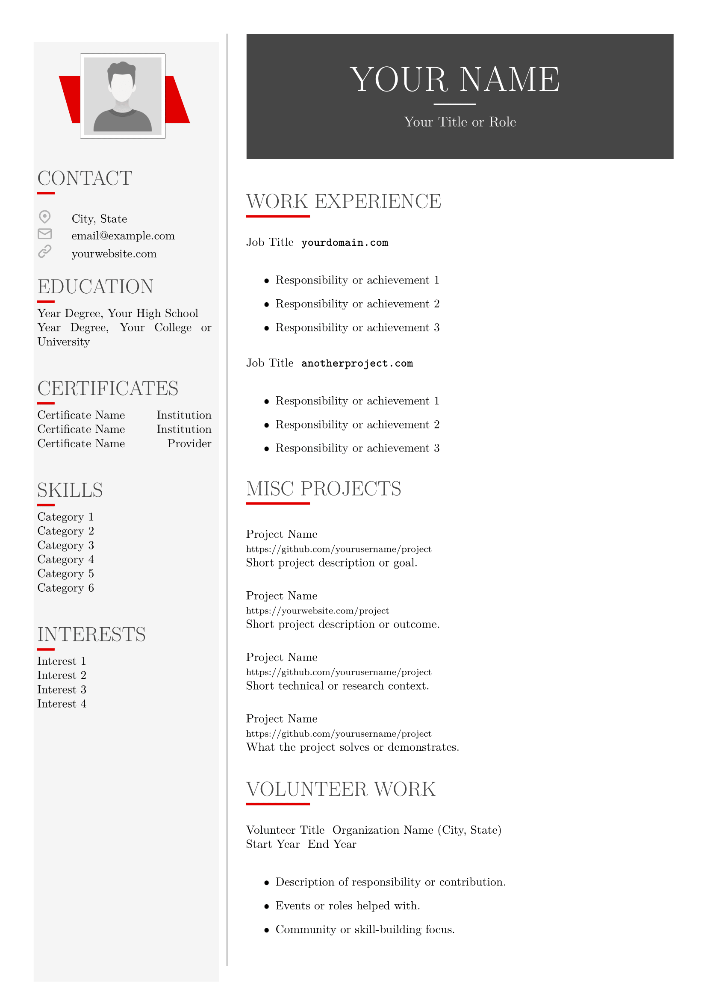

# 📄 texcv-builder PDF Generator

texcv-builder PDF Generator is a simple script to create `.pdf` documents using compiled CV LaTeX templating. It's good for fast .pdf prototyping without a PDF editor. Includes a custom hand-made theme.

<table>
<tr>
<td>


## Requirements

- Python 3.8+
- [`xelatex`](https://www.tug.org/xetex/) (for compiling the LaTeX resume)  
  - On Windows, this is typically installed with [MiKTeX](https://miktex.org/) via TeXworks
- [Inkscape](https://inkscape.org/) (for converting SVG icons to PDF)

## Usage

```bash
python export_resume.py --github your_github_username
````

Alternatively, to use a local avatar image:

```bash
python export_resume.py --avatar path/to/avatar.jpg
```

The resulting `resume.pdf` will be saved in the `output/` directory.

</td>
<td align="right" width="370">



</td>
</tr>
</table>


## File Structure

```
.
├── export_resume.py        # Python build script
├── jankapunkt-template/
│   ├── template.tex        # LaTeX resume source
│   └── untitled.jpg        # Fallback or default avatar
├── icons/                  # SVG icons (e.g., pin.svg → pin.pdf)
└── output/                 # Compiled resume and temporary files
```

> [!TIP]
> This simple script isn't meant to replace fancy software — resume-building platforms nor WYSIWYG editors.  
> It’s just a lightweight wrapper around a developer-centric tool for generating documents with customizable LaTeX templates.

## License

This project is licensed under the MIT License.

* jankapunkt-template/sidebar originally by **Jan Küster** (MIT, 2015)

See [LICENSE](./LICENSE) for full details.
